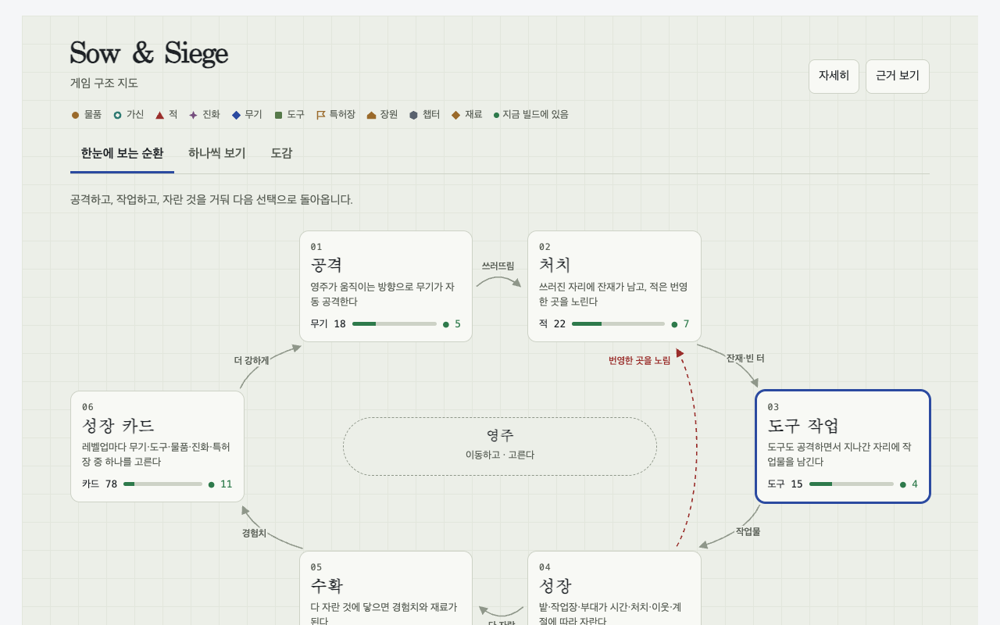
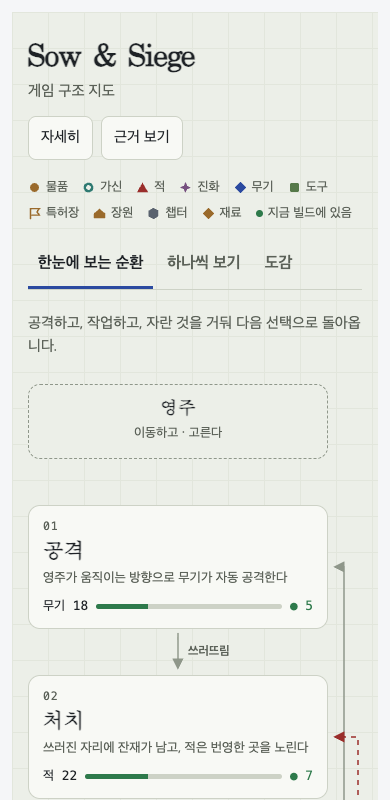

# L7 loop experience — acceptance evidence

Local automated gates pass: three generic views, source-bound agent summaries, and four repository extraction probes.
The approved prototype is the reference; public Pages usability acceptance remains the user's decision.
Static dependency analysis and mocked optional-provider tests are not compiler completeness or a live API execution claim.

## Repository provenance and coverage

| Repository | Source commit | Modules | Module folders | Fresh summaries | Graph nodes / edges |
| --- | --- | ---: | ---: | ---: | ---: |
| requests, no lens | `611c6162cbc4ac2020a2f91c7cfa4f3abf9bbb60` | 37 | 6 | 43/43 | 974 / 1,207 |
| ripgrep, no lens | `3fce3b5bb0236da2df6d99672afb8a719642eca7` | 113 | 29 | 142/142 | 9,043 / 4,051 |
| C&K example lens, read-only source | `251f397eb6646b81fd1dda0597255ee474806b49` | 197 | 14 | 211/211 | 1,890 / 2,667 |
| bs-mobile, no lens | `4e053beba7fb62349b320049d4cf3cb972080c08` | 344 | 17 | 361/361 | 59,979 / 13,523 |

Summaries cover every extracted module and module folder in these pinned probes. Actual Codex agent authoring used the stdio MCP context/write tools; Lattice does not infer text itself. External interpretation stores preserved the source checkouts, especially read-only C&K. bs-mobile's final no-lens CLI snapshot uses the clean `4e053be` source checkout; its C# source hashes remain unchanged from the measured build. Draft lenses remain inactive. The bs-mobile domain map and its no-lens source map are distinct projections.

Requests has 3 directed cross-folder dependency pairs representing 84 import references; ripgrep has 12 / 92; C&K has 56 / 526. Independent source/target-folder aggregation matched the rendered counts. Only module folders become fallback stages: mixed data/document folders do not inflate the module-map coverage denominator.

## Browser evidence

Chrome/Playwright at 1280×800 and 390×844 exercised requests, ripgrep and C&K: home → stage → source evidence, individual-node relationships, and catalog search. All six cases had zero browser errors, zero visible first-screen engineer metadata, no document-width overflow, visible AI attribution, and source evidence. On mobile the approved layout uses readable relationship lists instead of the desktop node diagram. Final Rust long headings wrap within their cards; duplicate relationship neighbors were removed before recapture.

| View | Screenshot |
| --- | --- |
| requests folder loop | [Desktop](evidence/l7-loop/requests-desktop-loop.png) |
| requests individual module | [Desktop](evidence/l7-loop/requests-desktop-focus.png) |
| requests catalog search and AI summary | [Desktop](evidence/l7-loop/requests-desktop-catalog.png) |
| C&K same generic loop with example lens | [Desktop](evidence/l7-loop/ck-desktop-loop.png) |
| ripgrep no-lens folder dependencies | [Desktop](evidence/l7-loop/rust-desktop-loop.png) |
| bs-mobile no-lens source summary | [Desktop](evidence/l7-loop/bs-structural-desktop-ai.png) |

The local evidence ledger retains all three views in both sizes for requests and C&K, Rust captures, interaction results and dependency-count oracle. The eight selected images here avoid committing redundant successful-run artifacts. All four repository probes verify AI summary attribution and source evidence links pinned to the actual source commit.

## Verification and limits

The final implementation passed 193 tests and the package smoke test. The optional CI adapter was tested through an actual subprocess and local HTTP mock, including changed-only input and absent-key skip; no paid/live provider call was made. CI and deployment links are supplied by the release PR, not inferred from local success.

Three cold-cache full bs-mobile builds took **8.894 s, 8.854 s and 9.095 s**, all below the 10 s build budget, on Apple M4 Max / Darwin arm64 / Node 25.8.2. The full parsed graphs stayed equal: 59,949 nodes, 13,493 edges, graph hash `8f88c9897e951ab6e988375c9cdeaea80685377e58ef32d9cc1ed3a824d40a12`. These local measurements do not establish CI-machine or mobile runtime performance.

Import/reference and named-definition extraction is static and conservative. C# namespace expansion and imports may overapproximate dependencies; dynamic loading, generated symbols, compiler conditional branches, macros and unresolved external references are not whole-program execution facts. Ambiguous/unresolved diagnostics remain visible in evidence. Semantic freshness binds summaries and draft provenance to source hashes; interpretation text remains labeled AI-authored and reviewable.

## Links

- [Approved prototype](../design/l7-prototype.html)
- [Interpretation contract and runner](l7-interpretation.md)
- [Optional CI adapter](../../examples/ci/README.md)
- [C&K example lens](../../examples/feudal-lord-simulator/lens.yaml)
